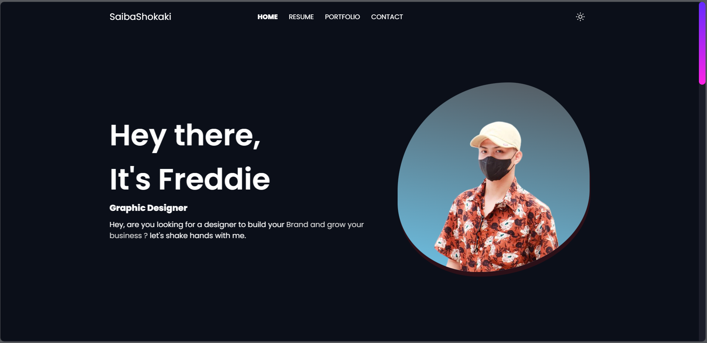
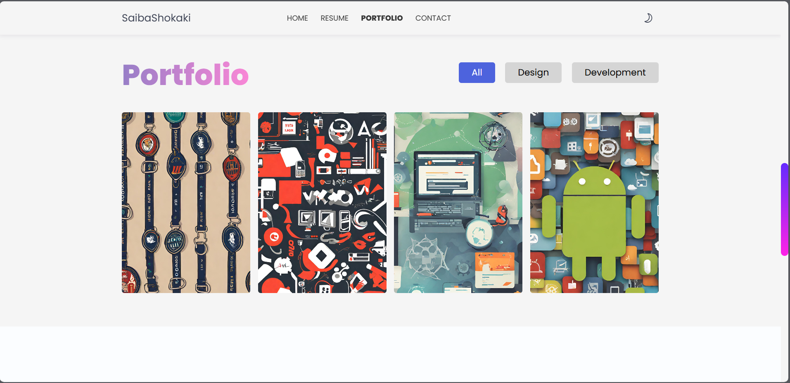

# 🚀 Freddie Alicante's Portfolio


## 📖 Description

Welcome to web portfolio! 🌟 I'm Freddie Alicante, a passionate Graphic Designer dedicated to creating visually stunning designs that inspire and engage. This portfolio showcases my journey, skills, and projects in a sleek, interactive web experience.

## ✨ Features

- 🌙 **Dark/Light Mode Toggle**: Switch between themes for a personalized viewing experience.
- 📱 **Responsive Design**: Looks great on all devices – desktop, tablet, and mobile.
- 🎨 **Smooth Scroll Behavior**: Enjoy seamless navigation with custom scroll animations.
- 📧 **Interactive Contact Form**: Reach out easily with EmailJS integration.
- 🖼️ **Portfolio Gallery**: Filter and view my design and development projects.
- 📄 **Resume Section**: Explore my education, experience, and skills with tabbed navigation.
- 🎯 **Hover Effects & Animations**: Engaging interactions powered by ScrollReveal.js.

## 🛠️ Tech Stack

- **HTML5** 📄
- **CSS3** 🎨 (Custom Properties, Flexbox, Grid)
- **JavaScript** ⚡
- **ScrollReveal.js** 🔄
- **EmailJS** 📬
- **LineIcons** 🎭

## 🖼️ User Interface Preview

### About Me Section

A clean and inviting introduction section showcasing the designer’s persona and professional greeting to visitors.

### Dark Mode Toggle

An elegant dark mode interface demonstrating the portfolio’s theme toggle feature for user comfort and accessibility.

### Home Section

The homepage layout featuring smooth navigation, branding, and a welcoming message to engage visitors immediately.

### Portfolio Section

A visually appealing portfolio gallery with filter options, highlighting diverse design and development projects.

## 🚀 Installation & Usage

1. **Clone the Repository**:
   ```
   git clone https://github.com/Siabashokaki/web-portfolio.git
   cd web-portfolio
   ```

2. **Open in Browser**:
   - Simply open `index.html` in your favorite web browser.
   - No server required – it's a static site!

3. **Navigate & Explore**:
   - Use the navigation menu to jump to sections: Home, Resume, Portfolio, Contact.
   - Toggle dark/light mode with the button in the top-right.
   - Download my CV from the Resume section.

## 📞 Contact Me

Let's connect! 🤝

- 📍 **Location**: Sta. Cruz, Palanas, Masbate
- 📞 **Phone**: (+63) 9704595292
- 📧 **Email**: Freddiealicante1a@gmail.com
- 🌐 **Social Links**:
  - [Facebook](https://www.facebook.com/itsme.fredds) 👥
  - [GitHub](https://github.com/itsme.freddie) 💻
  - [LinkedIn](https://www.linkedin.com/in/codewith-freddie) 🔗


---

⭐ If you like this portfolio, give it a star on GitHub! Thanks for visiting! 🙏
