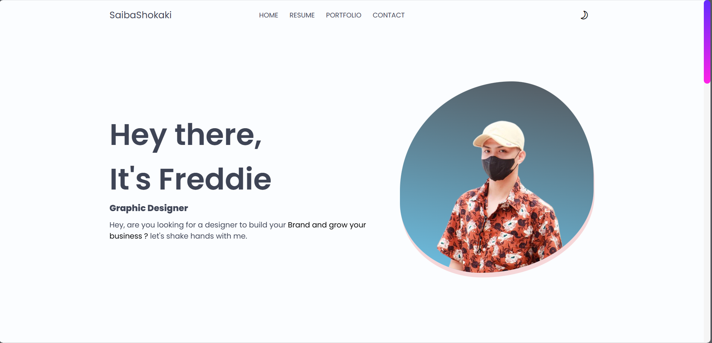
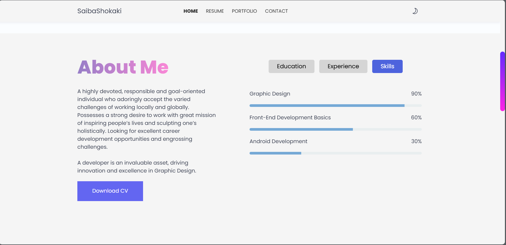

# 🚀 Freddie Alicante's Portfolio

## 📖 Description

Welcome to my professional portfolio website. I am Freddie Alicante, a dedicated Graphic Designer passionate about creating visually compelling designs that inspire and engage. This portfolio highlights my skills, experience, and projects in a clean and user-friendly interface.

## ✨ Features

- 🌙 Dark/Light Mode Toggle for personalized viewing experience
- 📱 Responsive design optimized for desktop, tablet, and mobile devices
- 🎯 Smooth scrolling navigation for seamless user experience
- 📧 Interactive contact form powered by EmailJS
- 🖼️ Portfolio gallery with filter options for design and development projects
- 📄 Detailed resume section with education, experience, and skills tabs
- ✨ Engaging animations using ScrollReveal.js

## 🛠️ Technology Stack

- 📝 HTML5
- 🎨 CSS3 (Custom Properties, Flexbox, Grid)
- ⚡ JavaScript
- 🔄 ScrollReveal.js
- 📬 EmailJS
- 🎭 LineIcons

## 🖼️ User Interface Preview

### Home Section

The homepage layout featuring smooth navigation, branding, and a welcoming message to engage visitors immediately.

### Dark Mode Toggle

An elegant dark mode interface demonstrating the portfolio’s theme toggle feature for user comfort and accessibility.

### About Me Section

A clean and inviting introduction section showcasing the designer’s persona and professional greeting to visitors.

### Portfolio Section

A visually appealing portfolio gallery with filter options, highlighting diverse design and development projects.

## 🚀 Installation & Usage

1. Clone the repository:
   ```
   git clone https://github.com/Siabashokaki/web-portfolio.git
   cd web-portfolio
   ```

2. Open `index.html` in your preferred web browser. No server setup required.

3. Navigate through the site using the menu to explore Home, Resume, Portfolio, and Contact sections.

## 📞 Contact

Feel free to get in touch!

- 📍 Location: Sta. Cruz, Palanas, Masbate
- 📞 Phone: (+63) 9704595292
- 📧 Email: Freddiealicante1a@gmail.com
- 🌐 Social Links:
  - [Facebook](https://www.facebook.com/itsme.fredds)
  - [GitHub](https://github.com/itsme.freddie)
  - [LinkedIn](https://www.linkedin.com/in/codewith-freddie)

---

🙏 Thank you for visiting my portfolio!
